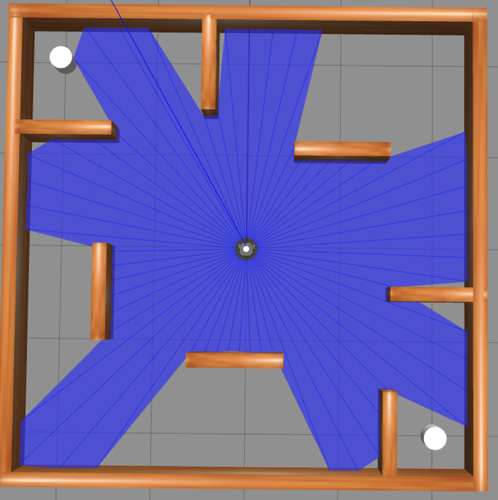
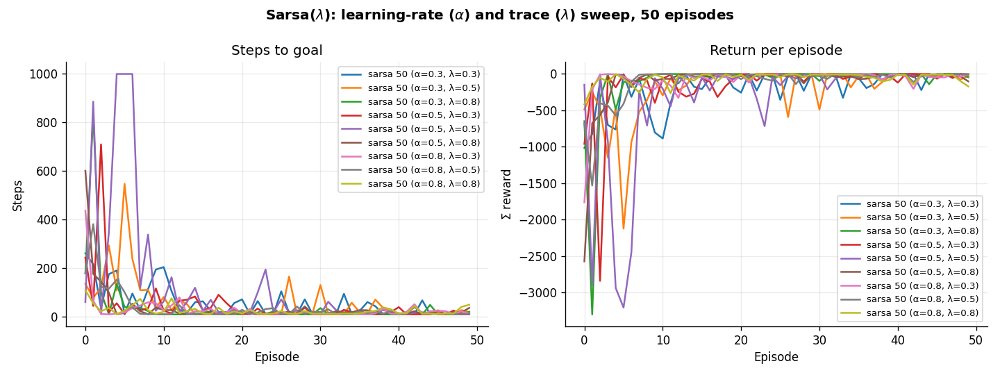
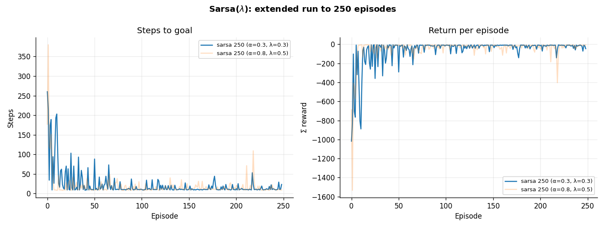
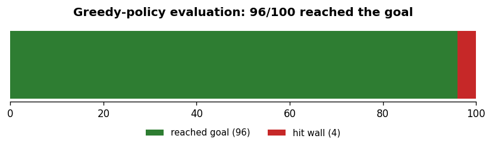
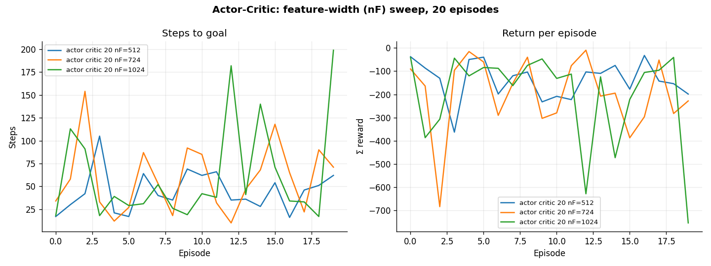

# Reinforcement Learning for Robot Maze Navigation

Teaching a TurtleBot3 to drive itself across a small maze-like Gazebo world and
stop within two feet of one of two goal pillars, without clipping any of the
walls. The robot only ever sees its 60-beam laser scan — no map, no odometry
for navigation — so it has to learn a policy straight from raw range readings.

I approached it two ways and compared them:

1. **Sarsa(λ)** with tile-coded features and linear function approximation.
2. **Actor-Critic** policy gradient with a convolutional neural network.

<p align="center">
  <br>
  <em>The environment. Each grid square is 1&nbsp;m. The robot starts in the centre; the two white pillars are the goals.</em>
</p>

The full write-up, with the environment/agent code and the reasoning behind
every design choice, is in [`maze_navigation.ipynb`](maze_navigation.ipynb).
This README is the short version.

## The state and the reward

**State.** A raw laser scan has 60 continuous readings, which are active far too
often for a linear learner to generalise from. So each reading is passed through
**tile coding**: it is turned into a one-hot vector over `num_tiles` bins, and
several offset tilings are laid over the range to add resolution. That gives a
sparse binary feature vector of size `num_lasers × num_tiles × num_tilings`,
with only `num_lasers × num_tilings` features active at a time. Sparse binary
features make the dot products cheap and the updates stable.

**Reward.** The agent gets `+10` for reaching a goal and `-10` for hitting a
wall. Every other step it receives a *negative* shaping reward equal to its
distance from the goal plus how far off it is pointing away from the goal. Only
negative intermediate rewards are used on purpose: a positive step reward can
make an agent dawdle to collect it, whereas a per-step penalty always pushes it
towards the shortest path. Non-forward moves get an extra `-1` to nudge it into
actually driving rather than spinning on the spot.

## Model 1 — Sarsa(λ), linear function approximation

Sarsa is a natural fit here: it is on-policy, online, and learns action values
directly from the rewards as the episode unfolds. The eligibility trace (the λ)
lets a single reward update the value of a whole run of recent states at once,
which noticeably speeds up convergence.

I swept the learning rate α and the trace decay λ over short 50-episode runs,
then re-ran the two most interesting settings out to 250 episodes:



The headline result is that lower α and λ win in the long run. `(α=0.3, λ=0.3)`
looked unremarkable early on but clearly pulled ahead once trained further —
higher values learn faster but stay noisier:



The agent is reliably reaching the goal in under 100 steps within ~25 episodes,
and settles under 30 steps per episode after ~125 (the 250-episode run took
about 2h on the VM). Evaluated greedily over 100 fresh episodes, the trained
policy reaches the goal **96 times out of 100**:



## Model 2 — Actor-Critic, neural network

For the second model I dropped the hand-designed features and fed the network
the normalised scan directly, letting a small 1-D convolutional net learn its
own representation. The Actor-Critic setup learns a policy (the actor) and a
value estimate (the critic) at the same time, trained from an experience-replay
buffer with a lagging target network for stability.



Honestly, this one only half worked. The agent frequently reaches the goal but
the return never settles into a stable improvement, so it is learning something
but not converging. I think the network architecture and the way batches are
fed into it are the weak points, and the runs were cut short by the VM crashing
on longer training. The linear model is the stronger of the two here; the deep
model is included because getting it working was instructive and the failure
mode is worth showing, not hiding.

## The `rl/` package

The learning algorithms live in a small, self-contained package rather than in
the notebook, so the interaction loop is written once and shared:

| Module | What it holds |
| --- | --- |
| `rl/core.py` | The episode/step loop (`interact`), ε-greedy control, metrics. Value estimation is left abstract. |
| `rl/linear.py` | Linear function approximation — `Sarsa` and `Sarsa(λ)`. |
| `rl/deep.py` | Neural-network function approximation (needs TensorFlow); the Actor-Critic base. |

The same loop drives all of them; a new algorithm is usually just a subclass
that overrides `online()` with its update rule. There is a tiny worked example
at the bottom of this README that trains `Sarsa(λ)` on a toy corridor with no
robot involved, if you want to see the framework run in a few seconds.

## Repository layout

```
maze_navigation.ipynb    the full write-up (Models 1 and 2, with results)
rl/                       the reinforcement-learning package
results/                  saved run data is plotted into figures here
  plots.py                regenerates every figure from saved_run_data/
saved_run_data/           per-episode metrics from the actual training runs
turtlebot3_assessment2/   Gazebo launch files and world (ROBOTIS, Apache-2.0)
gazebo_env.png            the environment
```

## Running it

**Reproduce the result figures** (no robot, no GPU — just numpy and matplotlib):

```bash
pip install -r requirements.txt
python results/plots.py
```

**Try the framework on a toy problem** — this trains `Sarsa(λ)` on a 1-D
corridor and needs nothing but the `rl` package:

```python
import numpy as np
from rl import linear

class Corridor:
    nA, nF = 3, 12
    def _x(self):
        x = np.zeros(self.nF)
        x[min(self.nF - 1, self.pos)] = 1.0
        return x
    def S_(self):    return np.eye(self.nF)
    def reset(self): self.pos = 0; return self._x()
    def step(self, a):
        self.pos += (a == 1)
        done = self.pos >= 10
        return self._x(), (10 if done else -1), done, {}
    def render(self, **kw): pass

agent = linear.Sarsaλ(env=Corridor(), λ=0.7, α=0.1, γ=0.95, episodes=60, seed=1)
agent.interact()
print("steps in the last episode:", agent.Ts[-1])   # heads towards the ~10-step optimum
```

**Full training in simulation** needs the robotics stack, which is not
pip-installable: ROS 2 (developed on Humble), Gazebo, and the `turtlebot3`
packages. With those installed you can launch the world from
`turtlebot3_assessment2/` and run the training cells in the notebook (set
`REVIEW_MODE = False`). The trained model files are not included in the repo.

## Credits and licence

Original work is under the MIT licence (see [`LICENSE`](LICENSE)). The Gazebo
launch and world files under `turtlebot3_assessment2/` are from ROBOTIS under
the Apache-2.0 licence, and the quaternion-to-Euler helper is adapted from a
public gist — both are recorded in [`NOTICE`](NOTICE).
